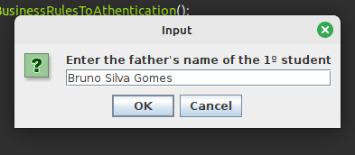
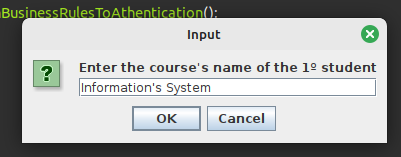
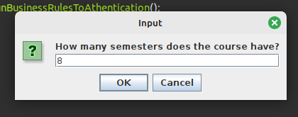
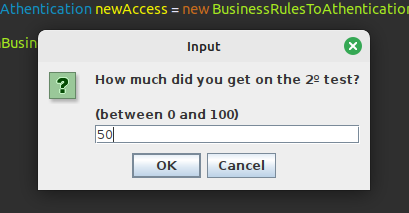

<h1 align="center">Creating one system a little more complex - Java Student System</h1>

## 📖️ About
<p>This is a more complex project using Java. Here I made a project to simulate a student system. The software calculates the average number of students based on the subjects presented relating to their course, having a login (simplified, just to get access to a platform). In the software it is possible to register secretaries, directors and register students with their subjects, course and grades to analyze performance and obtain the student's status (Approved or Failed).</p>

<br />

## 🤝️ Business rules
<p>The software was created based on rules of: <br /> <br />
-> Students must have 70 points or more to be Approved in school subject;<br />
-> The system only accepts grades between 0 and 100;<br />
-> To be approved in semester, the Student have an average of 70 points or more, combining the average of all subjects;<br />
-> The Software accepts one or more students to calculate the status of them;<br />
-> The Software accepts one or more Secretaries to be added on System with their informations;<br />
-> The Software accepts only one Director (In addition to those already registered for access to the system). There is no possibility to register others;<br />
-> By default, the system will have a director and a secretary configured for full access to the software (as per instructions below).
<br />
<br />
-- The default users registered:<br /> <br />
<> Secretary: login (admin) - password (admin); <br />
<> Director: login (admin) - password (1234). <br />
</p>


<br/>
<p align="center">Practical examples below</p>
<hr/>

<h3 align="center">Software presentation</h3>


<br/>

<h3 align="center">Enter Login</h3>


<br/>

<h3 align="center">Enter Password</h3>


<br/>

<h3 align="center">Choose a register option</h3>


<br/>

<h3 align="center">Choose how many students register</h3>


<br/>

<h3 align="center">Enter student's full name</h3>


<br/>

<h3 align="center">Enter student's CPF</h3>


<br/>

<h3 align="center">Student's date of birth</h3>


<br/>

<h3 align="center">Student's mother's name</h3>


<br/>

<h3 align="center">Student's father's name</h3>


<br/>

<h3 align="center">Student's course</h3>


<br/>

<h3 align="center">Start date of the student's studies</h3>


<br/>

<h3 align="center">Semesters of the course</h3>


<br/>

<h3 align="center">Subjects of the course</h3>


<br/>

<h3 align="center">First Discipline</h3>


<br/>

<h3 align="center">Grade 1</h3>


<br/>

<h3 align="center">Grade 2</h3>


<br/>

<h3 align="center">Second Discipline</h3>


<br/>

<h3 align="center">Grade 1</h3>


<br/>

<h3 align="center">Grade 2</h3>


<br/>

<h3 align="center">Third Discipline</h3>


<br/>

<h3 align="center">Grade 1</h3>


<br/>

<h3 align="center">Grade 2</h3>


<br/>

<h3 align="center">Fourth Discipline</h3>


<br/>

<h3 align="center">Grade 1</h3>


<br/>

<h3 align="center">Grade 2</h3>


<br/>

<h3 align="center">Confirmation to remove some discipline</h3>


<br/>

<h3 align="center">Confirmation to remove some student's information</h3>


<br/>

<h3 align="center">Confirmation to view students by status</h3>


<br/>

<h3 align="center">Approved Students</h3>


<br/>

<h3 align="center">Recovery Students</h3>


<br/>

<h3 align="center">Repproved Students</h3>


<br/>

<h3 align="center">End of software</h3>


<br/>
<br/>
<hr/>

## 🔨 Tools

- [OS - Linux Mint](https://www.linuxmint.com/download.php)
- [Java 22.ea.26-open across sdkman](https://sdkman.io/install)
- [Eclipse](https://eclipseide.org/)

<br />
<hr />

## 📚 Libs
- javax.swing.JOptionPane;
- java.util.ArrayList;
- java.util.List;
- java.util.HashMap;
- java.util.Objects;
- java.time.LocalDate;
- java.time.Period;
- java.time.format.DateTimeFormatter;
- java.time.format.DateTimeFormatterBuilder.

```bash
	#Clone this project
    git clone https://github.com/giovanni0800/java-students-system.git
```

## 📔️ License
This Project is under the MIT license. See the file LICENSE
for more details